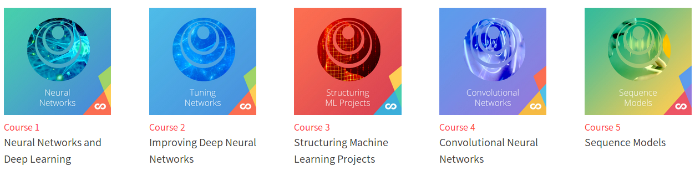
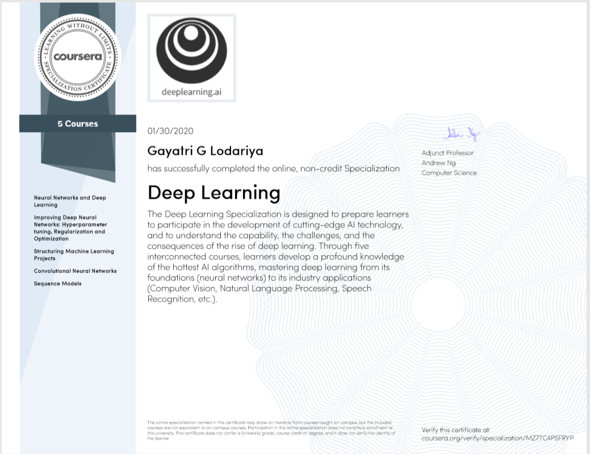

# Deep_Learning_Specialization
Little Learning is Dangerous Master Deep Learning, and Break into AI

Instructor: [Andrew Ng](http://www.andrewng.org/)  
Community: [deeplearning.ai](https://www.deeplearning.ai/)

## Overview

I created Coursera_Deep_Learning_Specialization repository post completing the [Deep Learning Specialization](https://www.coursera.org/specializations/deep-learning) on coursera. Its includes solutions to the quizzes (Except Course 4 quizzes) and programming assignments.

> Note: Coursera Honor Code advise against plagiarism. Readers are requested to use this repo only for insights and reference. If you are undertaking these courses at coursera, please submit you original work only.

The constitution of the repository as per course modules, quizzes and programming assignments is as follows:

1. [Neural Networks and Deep Learning](https://github.com/gayatri385/Coursera_Deep_Learning_Specialization/tree/master/1.%20Neural-Networks-and-Deep-Learning)
    * week 1
        * [Quiz - Introduction to deep learning](https://github.com/gayatri385/Coursera_Deep_Learning_Specialization/blob/master/1.%20Neural-Networks-and-Deep-Learning/week1/course%201%20-%20Neural%20Networks%20and%20Deep%20Learning)
    * week 2
        * [Quiz - Neural Network Basics](https://github.com/gayatri385/Coursera_Deep_Learning_Specialization/blob/master/1.%20Neural-Networks-and-Deep-Learning/week2/WEEK2_QUIZ.pdf)
        * [Programming Assignment - Python basics with numpy](https://github.com/gayatri385/Coursera_Deep_Learning_Specialization/blob/master/1.%20Neural-Networks-and-Deep-Learning/week2/Python_Basics_With_Numpy_v3a.ipynb)
        * [Programming Assignment - Logistic Regression with a Neural Network mindset](https://github.com/gayatri385/Coursera_Deep_Learning_Specialization/blob/master/1.%20Neural-Networks-and-Deep-Learning/week2/Logistic_Regression_with_a_Neural_Network_mindset_v6a.ipynb)
    * week 3
        * [Quiz - Shallow Neural Networks](https://github.com/gayatri385/Coursera_Deep_Learning_Specialization/blob/master/1.%20Neural-Networks-and-Deep-Learning/week3/WEEK3_QUIZ.pdf)
        * [Programming Assignment - Planar data classification with a hidden layer](https://github.com/gayatri385/Coursera_Deep_Learning_Specialization/blob/master/1.%20Neural-Networks-and-Deep-Learning/week3/Planar_data_classification_with_onehidden_layer_v6c.ipynb)
    * week 4
		* [Quiz - Key concepts on Deep Neural Networks] (https://github.com/gayatri385/Coursera_Deep_Learning_Specialization/blob/master/1.%20Neural-Networks-and-Deep-Learning/week4/WEEK4_QUIZ.pdf)
        * [Programming Assignment - Building your Deep Neural Network: Step by Step](https://github.com/gayatri385/Coursera_Deep_Learning_Specialization/blob/master/1.%20Neural-Networks-and-Deep-Learning/week4/Building_your_Deep_Neural_Network_Step_by_Step_v8a.ipynb)
        * [Programming Assignment - Deep Neural Network - Application](https://github.com/gayatri385/Coursera_Deep_Learning_Specialization/blob/master/1.%20Neural-Networks-and-Deep-Learning/week4/Deep%2BNeural%2BNetwork%2B-%2BApplication%2Bv8.ipynb)
2. [Improving Deep Neural Networks Hyperparameter tuning, Regularization and Optimization](https://github.com/gayatri385/Coursera_Deep_Learning_Specialization/tree/master/2.%20Improving-Deep-Neural-Networks)
    * week 1
        * [Quiz - Practical aspects of deep learning](https://github.com/gayatri385/Coursera_Deep_Learning_Specialization/blob/master/2.%20Improving-Deep-Neural-Networks/week1/WEEK1_QUIZ.pdf)
        * [Programming Assignment - Initialization](https://github.com/gayatri385/Coursera_Deep_Learning_Specialization/blob/master/2.%20Improving-Deep-Neural-Networks/week1/Initialization.ipynb)
        * [Programming Assignment - Regularization](https://github.com/gayatri385/Coursera_Deep_Learning_Specialization/blob/master/2.%20Improving-Deep-Neural-Networks/week1/Regularization_v2a.ipynb)
        * [Programming Assignment - Gradient Checking](https://github.com/gayatri385/Coursera_Deep_Learning_Specialization/blob/master/2.%20Improving-Deep-Neural-Networks/week1/Gradient%2BChecking%2Bv1.ipynb)
    * week 2
        * [Quiz - Optimization algorithms](https://github.com/gayatri385/Coursera_Deep_Learning_Specialization/blob/master/2.%20Improving-Deep-Neural-Networks/week2/WEEK2_QUIZ.pdf)
        * [Programming Assignment - Optimization](https://github.com/gayatri385/Coursera_Deep_Learning_Specialization/blob/master/2.%20Improving-Deep-Neural-Networks/week2/Optimization_methods_v1b.ipynb)
    * week 3
        * [Quiz - Hyperparameter tuning, Batch Normalization, Programming Frameworks](https://github.com/gayatri385/Coursera_Deep_Learning_Specialization/blob/master/2.%20Improving-Deep-Neural-Networks/week3/WEEK3_QUIZ.pdf)
        * [Programming Assignment - Tensorflow](https://github.com/gayatri385/Coursera_Deep_Learning_Specialization/blob/master/2.%20Improving-Deep-Neural-Networks/week3/TensorFlow_Tutorial_v3b.ipynb)
3. [Structuring Machine Learning Projects](https://github.com/gayatri385/Coursera_Deep_Learning_Specialization/tree/master/3.%20Structuring-Machine-Learning-Projects)
    * week 1
        * [Quiz - Bird recognition in the city of Peacetopia (case study)](https://github.com/gayatri385/Coursera_Deep_Learning_Specialization/blob/master/3.%20Structuring-Machine-Learning-Projects/week1/WEEK1_QUIZ.pdf)
    * week 2
        * [Quiz - Autonomous driving (case study)](https://github.com/gayatri385/Coursera_Deep_Learning_Specialization/blob/master/3.%20Structuring-Machine-Learning-Projects/week2/WEEK2_QUIZ.pdf)
4. [Convolutional Neural Networks](https://github.com/gayatri385/Coursera_Deep_Learning_Specialization/tree/master/4.%20Convolutional-Neural-Networks)
    * week 1
        * Quiz - The basics of ConvNets
        * [Programming Assignment - Convolutional Model: step by step](https://github.com/gayatri385/Coursera_Deep_Learning_Specialization/blob/master/4.%20Convolutional-Neural-Networks/week1/Convolution_model_Step_by_Step_v2a.ipynb)
        * [Programming Assignment - Convolutional Model: application](https://github.com/gayatri385/Coursera_Deep_Learning_Specialization/blob/master/4.%20Convolutional-Neural-Networks/week1/Convolution_model_Application_v1a.ipynb)
    * week 2
        * Quiz - Deep convolutional models
        * [Programming Assignment - Keras Tutorial](https://github.com/gayatri385/Coursera_Deep_Learning_Specialization/blob/master/4.%20Convolutional-Neural-Networks/week2/Keras_Tutorial_v2a.ipynb)
        * [Programming Assignment - Residual Networks](https://github.com/gayatri385/Coursera_Deep_Learning_Specialization/blob/master/4.%20Convolutional-Neural-Networks/week2/Residual_Networks_v2a.ipynb)
    * week 3
        * Quiz - Detection algorithms
        * [Programming Assignment - Car detection with YOLO](https://github.com/gayatri385/Coursera_Deep_Learning_Specialization/blob/master/4.%20Convolutional-Neural-Networks/week3/Autonomous_driving_application_Car_detection_v3a.ipynb)
    * week 4
        * Quiz - Special applications: Face recognition & Neural style transfer
        * [Programming Assignment - Art generation with Neural Style Transfer](https://github.com/gayatri385/Coursera_Deep_Learning_Specialization/blob/master/4.%20Convolutional-Neural-Networks/week4/Art_Generation_with_Neural_Style_Transfer_v3a.ipynb)
        * [Programming Assignment - Face Recognition](https://github.com/gayatri385/Coursera_Deep_Learning_Specialization/blob/master/4.%20Convolutional-Neural-Networks/week4/Face_Recognition_v3a.ipynb)
5. [Sequence Models](https://github.com/gayatri385/Coursera_Deep_Learning_Specialization/tree/master/5.%20Sequence-Models)
    * week 1
        * [Quiz - Recurrent Neural Networks](https://github.com/gayatri385/Coursera_Deep_Learning_Specialization/blob/master/5.%20Sequence-Models/week1/WEEK1_QUIZ.pdf)
        * [Programming Assignment - Building a recurrent neural network - step by step](https://github.com/gayatri385/Coursera_Deep_Learning_Specialization/blob/master/5.%20Sequence-Models/week1/Building_a_Recurrent_Neural_Network_Step_by_Step_v3a.ipynb)
        * [Programming Assignment - Dinosaur Island - Character-Level Language Modeling](https://github.com/gayatri385/Coursera_Deep_Learning_Specialization/blob/master/5.%20Sequence-Models/week1/Dinosaurus_Island_Character_level_language_model_final_v3a.ipynb)
        * [Programming Assignment - Jazz improvisation with LSTM](https://github.com/gayatri385/Coursera_Deep_Learning_Specialization/blob/master/5.%20Sequence-Models/week1/Improvise_a_Jazz_Solo_with_an_LSTM_Network_v3a.ipynb)
    * week 2
        * [Quiz - Natural Language Processing & Word Embeddings](https://github.com/gayatri385/Coursera_Deep_Learning_Specialization/blob/master/5.%20Sequence-Models/week2/WEEK2_QUIZ.pdf)
        * [Programming Assignment - Operations on word vectors - Debiasing](https://github.com/gayatri385/Coursera_Deep_Learning_Specialization/blob/master/5.%20Sequence-Models/week2/Operations_on_word_vectors_v2a.ipynb)
        * [Programming Assignment - Emojify](https://github.com/gayatri385/Coursera_Deep_Learning_Specialization/blob/master/5.%20Sequence-Models/week2/Emojify_v2a.ipynb)
    * week 3
        * [Quiz - Sequence models & Attention mechanism](https://github.com/gayatri385/Coursera_Deep_Learning_Specialization/blob/master/5.%20Sequence-Models/week3/WEEK3_QUIZ.pdf)
        * [Programming Assignment - Neural Machine Translation with Attention](https://github.com/gayatri385/Coursera_Deep_Learning_Specialization/blob/master/5.%20Sequence-Models/week3/Neural_machine_translation_with_attention_v4a.ipynb)
        * [Programming Assignment - Trigger word detection](https://github.com/gayatri385/Coursera_Deep_Learning_Specialization/blob/master/5.%20Sequence-Models/week3/Trigger_word_detection_v1a.ipynb)

## Lecture Notes References
Here are some references of lecture notes and reviews drawn by some communities, authors and editors - 
* https://www.deeplearning.ai/ai-notes/
* https://www.slideshare.net/TessFerrandez/notes-from-coursera-deep-learning-courses-by-andrew-ng
* https://towardsdatascience.com/deep-learning-specialization-by-andrew-ng-21-lessons-learned-15ffaaef627c

## Acknowledgement

Special thanks to coursera for making our lives easy by providing such valuable courses & Sir Andrew Ng who provided all the tricks and turns of deep learning. It feels like a new SUPERPOWER which will help us build AI systems. Its great content for all deep learning enthusiasts.

